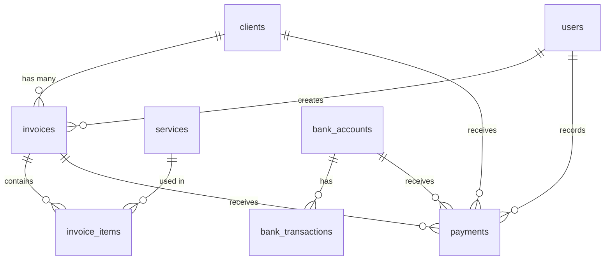

# Finance Management System - Complete Documentation

## System Overview
Sistem Finance Management yang dibangun menggunakan Laravel 12, Livewire 3, dan TallStackUI. Sistem ini mengelola seluruh aspek keuangan bisnis dari client management hingga reporting dengan pendekatan modular untuk maintainability.

---

## Complete Menu Structure

```
Finance Management System
├── 📊 Dashboard
├── 👥 Client Management
├── 📄 Invoice Management  
├── 💰 Payment Management
├── 🏦 Bank Account Management
├── 🛠️ Service Management
├── 📈 Financial Reports
├── ⚙️ Settings
└── 👤 User Management
```

---

## 1. 📊 Dashboard

### Purpose
Central hub untuk overview seluruh sistem keuangan dengan real-time statistics dan quick actions.

### Components Structure
```
app/Livewire/Dashboard/
├── Index.php                    # Main dashboard
├── StatsCards.php              # Statistics widgets
├── RecentActivities.php        # Activity feed
├── QuickActions.php            # Quick action buttons
├── Charts/
│   ├── RevenueChart.php        # Revenue over time
│   ├── ClientGrowth.php        # Client acquisition
│   └── PaymentStatus.php       # Payment status pie chart
└── Widgets/
    ├── OverdueInvoices.php     # Overdue invoice alerts
    ├── TopClients.php          # Best performing clients
    └── CashFlow.php            # Cash flow summary
```

### Features
#### Stats Cards
- ✅ Total Revenue (current month vs previous)
- ✅ Outstanding Invoices (amount & count)
- ✅ Active Clients vs New Clients
- ✅ This Month Collections
- ✅ Bank Account Balances (total)

#### Charts & Analytics
- ✅ Monthly Revenue Trend (12 months)
- ✅ Payment Status Distribution (Paid/Pending/Overdue)
- ✅ Client Growth Chart
- ✅ Service Revenue Breakdown
- ✅ Cash Flow Analysis

#### Recent Activities
- ✅ Latest Invoice Created
- ✅ Recent Payments Received
- ✅ New Clients Added
- ✅ Overdue Invoice Alerts
- ✅ System Activities Log

#### Quick Actions
- ✅ Create New Invoice
- ✅ Add New Client
- ✅ Record Payment
- ✅ Add Bank Transaction
- ✅ Generate Report

---

## 2. 👥 Client Management

### Components Structure
```
app/Livewire/Client/
├── Index.php                   # Main coordinator
├── Listing.php                 # Client listing & search
├── Create.php                  # Create new client
├── Edit.php                    # Edit existing client
├── Show.php                    # Client detail view
├── Delete.php                  # Delete with dependencies
├── Relationship.php            # Individual-company relationships
├── Import.php                  # Bulk import clients
├── Export.php                  # Export client data
└── Merge.php                   # Merge duplicate clients
```

### Features
#### Core CRUD Operations
- ✅ Create Client (Individual/Company)
- ✅ Edit Client Information
- ✅ View Client Details
- ✅ Delete Client (with dependency checks)
- ✅ Bulk Operations (activate/deactivate/delete)

#### Advanced Features
- ✅ Client Relationship Management (Owner-Company)
- ✅ Client Import/Export (Excel/CSV)
- ✅ Duplicate Detection & Merge
- ✅ Client Categorization & Tags
- ✅ Client Communication History
- ✅ Client Document Management

#### Search & Filter
- ✅ Real-time search (name, email, NPWP)
- ✅ Advanced filters (type, status, date range)
- ✅ Saved search queries
- ✅ Export filtered results

#### Integration Features
- ✅ Client Financial Summary
- ✅ Invoice History per Client
- ✅ Payment History per Client
- ✅ Outstanding Balance per Client

---

## 3. 📄 Invoice Management

### Components Structure
```
app/Livewire/Invoice/
├── Index.php                   # Main coordinator
├── Listing.php                 # Invoice listing & filters
├── Create.php                  # Create new invoice
├── Edit.php                    # Edit draft invoice
├── Show.php                    # Invoice detail view
├── Delete.php                  # Delete invoice
├── Send.php                    # Send invoice to client
├── Print.php                   # Print/PDF generation
├── Duplicate.php              # Duplicate existing invoice
├── BulkActions.php            # Bulk operations
└── Templates/
    ├── StandardTemplate.php    # Standard invoice template
    ├── ServiceTemplate.php     # Service-based template
    └── CustomTemplate.php      # Custom template builder
```

### Features
#### Core Operations
- ✅ Create Invoice (Manual/From Template)
- ✅ Edit Draft Invoices
- ✅ Send Invoice (Email/WhatsApp/Print)
- ✅ Track Invoice Status
- ✅ Invoice Versioning
- ✅ Duplicate Invoice

#### Invoice Items Management
- ✅ Add Service Items
- ✅ Custom Line Items
- ✅ Quantity & Rate Management
- ✅ Tax Calculations
- ✅ Discount Management
- ✅ Currency Support

#### Status Management
- ✅ Draft → Sent → Paid → Overdue
- ✅ Partial Payment Tracking
- ✅ Payment Reminder System
- ✅ Auto Status Updates
- ✅ Payment Terms Management

#### Templates & Customization
- ✅ Multiple Invoice Templates
- ✅ Company Branding
- ✅ Custom Fields
- ✅ Terms & Conditions
- ✅ Multi-language Support

#### Bulk Operations
- ✅ Bulk Send Invoices
- ✅ Bulk Status Updates
- ✅ Bulk Export
- ✅ Bulk Delete/Archive

---

## 4. 💰 Payment Management

### Components Structure
```
app/Livewire/Payment/
├── Index.php                   # Main coordinator
├── Listing.php                 # Payment listing
├── Create.php                  # Record new payment
├── Edit.php                    # Edit payment record
├── Show.php                    # Payment detail view
├── Delete.php                  # Delete payment
├── Reconciliation.php          # Bank reconciliation
├── BulkImport.php             # Import bank statements
└── Reports/
    ├── PaymentSummary.php      # Payment summary reports
    ├── ClientPayments.php      # Client payment history
    └── BankReconciliation.php  # Reconciliation reports
```

### Features
#### Core Operations
- ✅ Record Payment (Cash/Bank Transfer)
- ✅ Link Payment to Invoice
- ✅ Partial Payment Support
- ✅ Overpayment Handling
- ✅ Payment Refunds
- ✅ Payment Cancellation

#### Payment Methods
- ✅ Cash Payments
- ✅ Bank Transfers
- ✅ Check Payments
- ✅ Online Payment Integration
- ✅ Installment Payments

#### Bank Integration
- ✅ Bank Statement Import
- ✅ Auto Payment Matching
- ✅ Bank Reconciliation
- ✅ Multiple Bank Account Support
- ✅ Transaction Categorization

#### Payment Tracking
- ✅ Payment Status Tracking
- ✅ Payment Follow-ups
- ✅ Outstanding Balance Reports
- ✅ Payment Analytics
- ✅ Client Payment Behavior

---

## 5. 🏦 Bank Account Management

### Components Structure
```
app/Livewire/BankAccounts/
├── Index.php                    # ✅ Created - Main dashboard
├── Create.php                   # 🔄 Need - Add bank account form
├── Edit.php                     # 🔄 Need - Edit bank account form  
├── Show.php                     # 🔄 Need - Account details + mini transactions
├── Listing.php                  # 🔄 Need - Bank accounts table/grid
└── Delete.php                   # 🔄 Need - Delete with validation

app/Livewire/BankTransactions/
├── Index.php                    # 🔄 Need - Transaction dashboard
├── Listing.php                  # 🔄 Need - Transactions table with filters
├── Create.php                   # 🔄 Need - Universal transaction form
├── Edit.php                     # 🔄 Need - Edit transaction form
├── Show.php                     # 🔄 Need - Transaction details
├── Delete.php                   # 🔄 Need - Delete transaction
└── Types/
    ├── ManualTransaction.php    # 🔄 Need - Basic income/expense
    ├── InterBankTransfer.php    # 🔄 Need - Transfer with admin fee
    ├── InternalTransfer.php     # 🔄 Need - Between own accounts
    ├── RecurringTransaction.php # 🔄 Need - Scheduled transactions
    ├── SplitTransaction.php     # 🔄 Need - Multiple categories
    └── BulkEntry.php           # 🔄 Need - Multiple transactions
```

### 📋 **Implementation Priority**

#### **Phase 1: Core CRUD**
1. `BankAccounts/Create.php` - Basic account creation
2. `BankAccounts/Listing.php` - Account management table
3. `BankTransactions/Listing.php` - Transaction history

#### **Phase 2: Transaction Types**
4. `BankTransactions/ManualTransaction.php` - Most used
5. `BankTransactions/InternalTransfer.php` - Internal operations
6. `BankTransactions/Edit.php` - Transaction corrections

#### **Phase 3: Advanced Features**
7. `BankTransactions/InterBankTransfer.php` - External transfers
8. `BankTransactions/RecurringTransaction.php` - Automation
9. `BankTransactions/BulkEntry.php` - Batch operations


### Features
#### Account Management
- ✅ Multiple Bank Account Support
- ✅ Account Details Management
- ✅ Opening/Closing Balances
- ✅ Account Status Tracking
- ✅ Account Categories

#### Transaction Management
- ✅ Manual Transaction Entry
- ✅ Bank Statement Import
- ✅ Transaction Categorization
- ✅ Recurring Transactions
- ✅ Transaction Search & Filter

#### Reconciliation
- ✅ Bank Statement Reconciliation
- ✅ Outstanding Transaction Tracking
- ✅ Reconciliation Reports
- ✅ Variance Analysis
- ✅ Auto-matching Rules

#### Reports & Analytics
- ✅ Account Balance History
- ✅ Cash Flow Statements
- ✅ Bank Reconciliation Reports
- ✅ Transaction Analysis
- ✅ Account Performance Metrics

---

## 6. 🛠️ Service Management

### Components Structure
```
app/Livewire/Service/
├── Index.php                   # Main coordinator
├── Listing.php                 # Service listing
├── Create.php                  # Add new service
├── Edit.php                    # Edit service
├── Show.php                    # Service detail view
├── Delete.php                  # Delete service
├── Category.php                # Service categories
├── Pricing.php                 # Pricing management
└── Reports/
    ├── ServiceRevenue.php      # Revenue per service
    ├── ServiceUsage.php        # Usage analytics
    └── ProfitAnalysis.php      # Profit analysis
```

### Features
#### Service Management
- ✅ Service CRUD Operations
- ✅ Service Categories (Perizinan, Administrasi Perpajakan, etc.)
- ✅ Service Descriptions
- ✅ Service Status (Active/Inactive)
- ✅ Service Templates

#### Pricing Management
- ✅ Base Price Management
- ✅ Client-specific Pricing
- ✅ Volume Discounts
- ✅ Seasonal Pricing
- ✅ Price History Tracking

#### Service Analytics
- ✅ Most Popular Services
- ✅ Revenue per Service
- ✅ Service Profitability
- ✅ Usage Trends
- ✅ Client Service Preferences

---

## 7. 📈 Financial Reports

### Components Structure
```
app/Livewire/Report/
├── Index.php                   # Report dashboard
├── Revenue/
│   ├── Monthly.php             # Monthly revenue reports
│   ├── Annual.php              # Annual revenue reports
│   ├── ByClient.php           # Revenue by client
│   └── ByService.php          # Revenue by service
├── Outstanding/
│   ├── Invoices.php           # Outstanding invoices
│   ├── Aging.php              # Aging analysis
│   └── Collection.php         # Collection reports
├── Payment/
│   ├── Summary.php            # Payment summaries
│   ├── Trends.php             # Payment trends
│   └── Methods.php            # Payment method analysis
├── Client/
│   ├── Analysis.php           # Client analysis
│   ├── Profitability.php     # Client profitability
│   └── Growth.php             # Client growth
├── Financial/
│   ├── ProfitLoss.php         # P&L statements
│   ├── CashFlow.php           # Cash flow statements
│   └── BalanceSheet.php       # Balance sheet (simplified)
└── Export/
    ├── ExcelExport.php        # Excel exports
    ├── PDFExport.php          # PDF exports
    └── CSVExport.php          # CSV exports
```

### Features
#### Revenue Reports
- ✅ Monthly/Quarterly/Annual Revenue
- ✅ Revenue by Client
- ✅ Revenue by Service Category
- ✅ Revenue Growth Analysis
- ✅ Revenue Forecasting

#### Outstanding Reports
- ✅ Outstanding Invoice Summary
- ✅ Aging Analysis (30/60/90 days)
- ✅ Collection Efficiency Reports
- ✅ Bad Debt Analysis
- ✅ Payment Prediction

#### Client Reports
- ✅ Client Profitability Analysis
- ✅ Top Performing Clients
- ✅ Client Payment Behavior
- ✅ Client Growth Reports
- ✅ Client Risk Assessment

#### Financial Statements
- ✅ Profit & Loss Statements
- ✅ Cash Flow Statements
- ✅ Revenue vs Expenses
- ✅ Tax Reports (Simplified)
- ✅ Financial Ratios

#### Export & Sharing
- ✅ PDF Reports
- ✅ Excel Exports
- ✅ Scheduled Reports
- ✅ Email Distribution
- ✅ Report Templates

---

## 8. ⚙️ Settings

### Components Structure
```
app/Livewire/Setting/
├── Index.php                   # Settings dashboard
├── Company/
│   ├── Profile.php            # Company information
│   ├── Branding.php           # Logo, colors, themes
│   └── Contact.php            # Contact information
├── Invoice/
│   ├── Templates.php          # Invoice templates
│   ├── Numbering.php          # Invoice numbering
│   ├── Terms.php              # Payment terms
│   └── TaxSettings.php        # Tax configuration
├── Payment/
│   ├── Methods.php            # Payment methods
│   ├── Gateways.php           # Payment gateways
│   └── Currencies.php         # Currency settings
├── Notification/
│   ├── Email.php              # Email settings
│   ├── SMS.php                # SMS settings
│   └── Templates.php          # Notification templates
├── System/
│   ├── General.php            # General settings
│   ├── Backup.php             # Backup settings
│   └── Maintenance.php        # Maintenance mode
└── Integration/
    ├── Accounting.php         # Accounting software
    ├── Banking.php            # Banking APIs
    └── ThirdParty.php         # Third-party services
```

### Features
#### Company Settings
- ✅ Company Profile Management
- ✅ Logo & Branding
- ✅ Contact Information
- ✅ Business Registration Details
- ✅ Tax Information

#### Invoice Settings
- ✅ Invoice Template Management
- ✅ Invoice Numbering Rules
- ✅ Default Payment Terms
- ✅ Tax Settings
- ✅ Currency Configuration

#### System Settings
- ✅ User Permissions
- ✅ Backup Configuration
- ✅ Email Settings
- ✅ Notification Preferences
- ✅ System Maintenance

---

## 9. 👤 User Management

### Components Structure
```
app/Livewire/User/
├── Index.php                   # User management dashboard
├── Listing.php                 # User listing
├── Create.php                  # Add new user
├── Edit.php                    # Edit user
├── Show.php                    # User profile
├── Delete.php                  # Delete user
├── Role/
│   ├── Listing.php            # Role management
│   ├── Create.php             # Create role
│   ├── Edit.php               # Edit role
│   └── Permissions.php        # Permission management
└── Activity/
    ├── Listing.php            # Activity logs
    └── Reports.php            # Activity reports
```

### Features
#### User Management
- ✅ User CRUD Operations
- ✅ User Profile Management
- ✅ Password Management
- ✅ User Status Management
- ✅ User Activity Tracking

#### Role & Permissions
- ✅ Role-based Access Control
- ✅ Permission Management
- ✅ Custom Roles
- ✅ Resource-based Permissions
- ✅ User Role Assignment

#### Security Features
- ✅ Two-Factor Authentication
- ✅ Login Activity Tracking
- ✅ Password Policies
- ✅ Session Management
- ✅ Audit Logs

---

## Database Structure Overview

### Core Tables
```sql
-- Client Management
clients
client_relationships

-- Service Management  
services

-- Invoice Management
invoices
invoice_items

-- Payment Management
payments
bank_accounts
bank_transactions

-- User Management
users
roles
permissions
role_permissions
user_roles

-- System Tables
activity_logs
settings
notifications
```

### Key Relationships


---

## Implementation Phases

### Phase 1: Foundation (Week 1-2)
- ✅ ~~Client Management (Complete CRUD)~~
- [ ] Service Management (Basic CRUD)
- [ ] Basic Dashboard
- [ ] User Authentication

### Phase 2: Core Features (Week 3-4)
- [ ] Invoice Management (Complete)
- [ ] Payment Management (Core features)
- [ ] Bank Account Management
- [ ] Basic Reports

### Phase 3: Advanced Features (Week 5-6)
- [ ] Advanced Reporting
- [ ] Bulk Operations
- [ ] Import/Export Features
- [ ] Email Notifications

### Phase 4: Polish & Integration (Week 7-8)
- [ ] Advanced Analytics
- [ ] API Integration
- [ ] Mobile Optimization
- [ ] Performance Optimization

---

## Technology Stack

### Backend
- **Laravel 12** - Framework
- **Livewire 3** - Frontend reactivity
- **PHP 8.4** - Language version
- **MySQL 8** - Database

### Frontend
- **TallStackUI** - UI Components
- **TailwindCSS 4** - Styling
- **AlpineJS 3** - JavaScript interactions
- **Flux** - Layout components (Laravel 12)

### Additional Tools
- **Spatie Packages** (Permission, Activity Log, etc.)
- **Laravel Excel** - Import/Export
- **DomPDF** - PDF Generation
- **PHPUnit** - Testing

---

## File Structure Summary

```
app/
├── Livewire/
│   ├── Dashboard/             # 📊 Dashboard components
│   ├── Client/                # 👥 Client management
│   ├── Invoice/               # 📄 Invoice management
│   ├── Payment/               # 💰 Payment management
│   ├── BankAccount/           # 🏦 Bank account management
│   ├── Service/               # 🛠️ Service management
│   ├── Report/                # 📈 Financial reports
│   ├── Setting/               # ⚙️ System settings
│   └── User/                  # 👤 User management

resources/views/livewire/
├── dashboard/                 # Dashboard views
├── client/                    # Client views
├── invoice/                   # Invoice views
├── payment/                   # Payment views
├── bank-account/              # Bank account views
├── service/                   # Service views
├── report/                    # Report views
├── setting/                   # Setting views
└── user/                      # User views

routes/
├── web.php                    # Main routes
├── api.php                    # API routes (optional)
└── auth.php                   # Authentication routes
```

---

## Next Steps

1. **Complete Client Management** - Finish remaining components
2. **Service Management** - Basic CRUD operations
3. **Invoice Management** - Core functionality
4. **Payment Management** - Basic recording
5. **Dashboard Integration** - Connect all components

Apakah dokumentasi lengkap ini sudah sesuai dengan kebutuhan sistem finance management Anda?